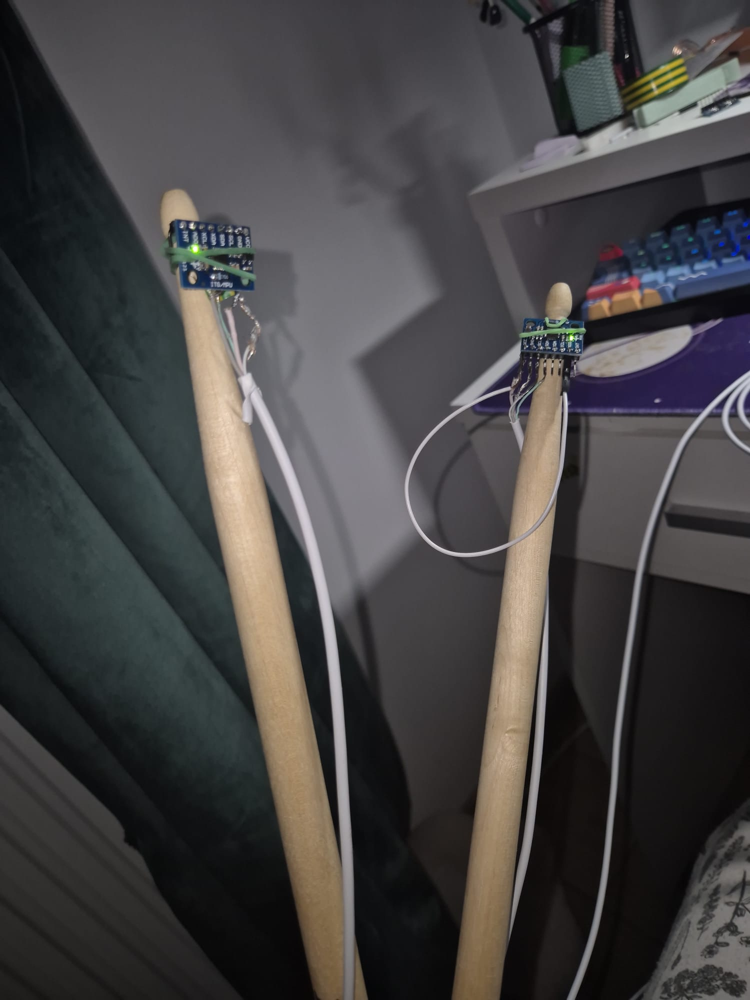
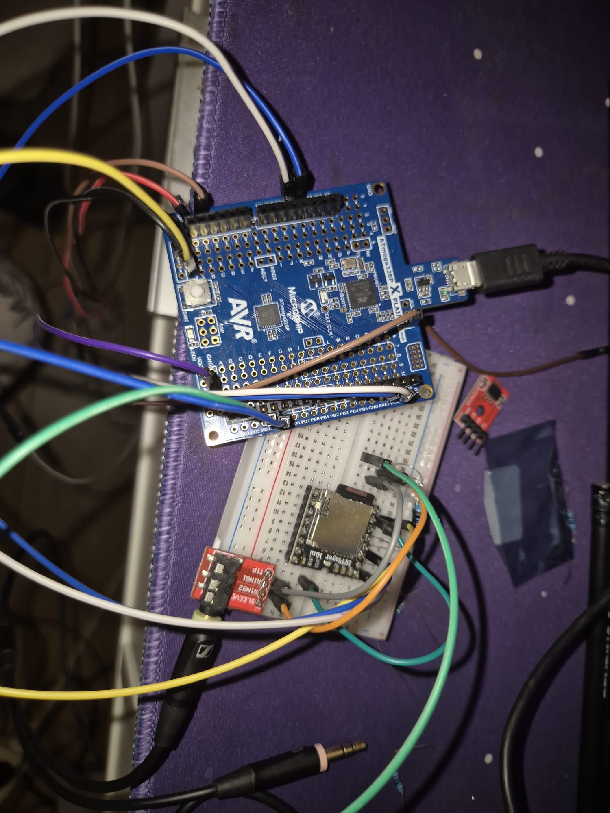
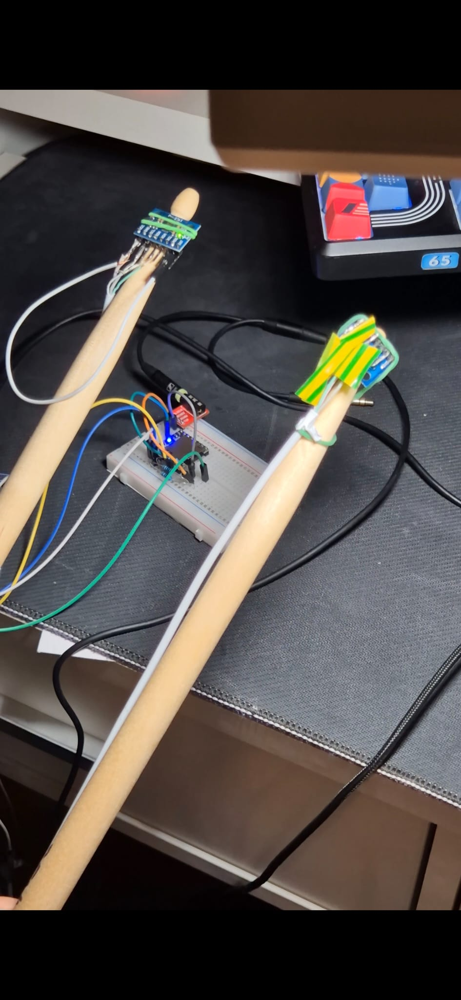

---

## Componente folosite si rolul lor

---

### ATmega328P Xplained Mini
**Rol:** Microcontroler central. Citeste datele de la senzori prin I2C, decide ce toba a fost lovita prin algoritmul de detectie, trimite comenzi audio prin UART si date spre telefon prin Bluetooth.

**Pini folositi:**

| Pin | Functie | De ce |
|---|---|---|
| PC4 / SDA | I2C Date | Comunicatie cu ambele MPU-6050 si LCD |
| PC5 / SCL | I2C Ceas | Sincronizare bus I2C |
| PD4 | UART TX → DFPlayer RX | Trimite comenzi play() spre DFPlayer |
| PD5 | UART RX ← DFPlayer TX | Primeste raspunsuri de la DFPlayer |
| PD6 | SoftSerial TX → HC-05 RXD | Trimite date tobe spre telefon prin Bluetooth |
| PD7 | SoftSerial RX ← HC-05 TXD | Primeste comenzi de la telefon (viitor) |
| PB5 | LED on-board | Indicator vizual lovitura detectata |
| 5V (J202-5) | Alimentare | Furnizeaza 5V pentru toate modulele |
| 3.3V (J202-4) | AD0 MPU#2 | Seteaza adresa I2C la 0x69 |
| GND (J202-6) | Masa comuna | Referinta de tensiune pentru tot circuitul |

---

### MPU-6050 #1 - GY-521 (bata stanga)
**Rol:** Senzor IMU (giroscop + accelerometru 3 axe) montat pe varful betei stangi. Detecteaza directia si intensitatea loviturii. Comunica prin I2C la adresa **0x68** (AD0 = GND).

**Pini folositi:**

| Pin | Conectat la | De ce |
|---|---|---|
| VDD | 5V | Alimentare modul |
| GND | GND | Masa |
| SDA | PC4 (bus I2C) | Transmite datele de acceleratie |
| SCL | PC5 (bus I2C) | Primeste semnalul de ceas |
| AD0 | GND | Seteaza adresa I2C la 0x68 |
| Restul | NC | Neutilizati in aceasta aplicatie |

---

### MPU-6050 #2 - GY-521 (bata dreapta)
**Rol:** Identic cu MPU#1 dar pentru bata dreapta. Adresa I2C diferita (**0x69**, AD0 = 3.3V) pentru a coexista pe acelasi bus.

**Pini folositi:**

| Pin | Conectat la | De ce |
|---|---|---|
| VDD | 5V | Alimentare modul |
| GND | GND | Masa |
| SDA | PC4 (bus I2C) | Acelasi fir SDA ca MPU#1 |
| SCL | PC5 (bus I2C) | Acelasi fir SCL ca MPU#1 |
| AD0 | 3.3V | Seteaza adresa I2C la 0x69 - diferit de MPU#1 |
| Restul | NC | Neutilizati |

---

### DFPlayer Mini
**Rol:** Modul de redare audio MP3. Stocheaza fisierele de sunet pe card SD si le reda la comanda prin UART. Iesirea audio trece prin modulul jack spre amplificator.

**Pini folositi:**

| Pin | Conectat la | De ce |
|---|---|---|
| VCC | 5V | Alimentare modul |
| GND | GND | Masa |
| RX | PD4 prin 1kΩ | Primeste comenzi play() - rezistorul protejeaza intrarea 3.3V fata de logica 5V a ATmega |
| TX | PD5 direct | Trimite confirmari/stare spre ATmega |
| DAC_R | Jack R prin 100Ω | Iesire audio canal drept - rezistorul limiteaza curentul spre jack |
| DAC_L | Jack L prin 100Ω | Iesire audio canal stang |
| Restul | NC | SPK1/SPK2 neutilizati (folosim DAC nu speaker direct) |

---

### Modul Jack TRRS 3.5mm
**Rol:** Conector audio. Preia semnalul line-level de la DFPlayer si il transmite spre amplificatorul de chitara prin adaptorul 3.5mm → 6.35mm.

**Pini folositi:**

| Pin | Conectat la | De ce |
|---|---|---|
| R (Ring) | DAC_R prin 100Ω | Canal drept audio |
| L (Tip) | DAC_L prin 100Ω | Canal stang audio |
| GND (Sleeve) | GND DFPlayer | Masa audio - conectat direct la GND DFPlayer (nu la ATmega) pentru a evita ground loop |
| Plug Detect | NC | Neutilizat |

---

### Rezistoare
**Rol:** Protectie si adaptare de nivel.

| Valoare | Pozitie | De ce |
|---|---|---|
| 1kΩ | ATmega PD4 → DFPlayer RX | Conversie nivel logic 5V → 3.3V |
| 100Ω × 2 | DFPlayer DAC_R/L → Jack | Limitare curent pe iesirea audio, protectie DAC |

---

## Stadiul actual al implementarii hardware

---

VIDEO: https://drive.google.com/file/d/1HWfQtBRlDKAbEOLy2Pm1YRPbaXR4ARDW/view?usp=sharing

### Componente conectate si functionale

**ATmega328P Xplained Mini** - placa principala conectata si programata. Ruleaza algoritmul de detectie a loviturilor, gestioneaza comunicatia I2C cu senzorii si trimite comenzi audio prin UART.

**MPU-6050 #1 (bata stanga)** - conectat pe bus-ul I2C la adresa 0x68 (AD0 = GND). Detecteaza si clasifica loviturile in stanga, mijloc si dreapta.

**MPU-6050 #2 (bata dreapta)** - conectat pe acelasi bus I2C la adresa 0x69 (AD0 = 3.3V). Functioneaza independent de MPU#1, permite detectie simultana pe ambele bete.

**DFPlayer Mini** - conectat prin SoftwareSerial (PD4/PD5). Cardul SD contine fisierele audio pentru cele 3 tipuri de lovituri. Redarea functioneaza la detectarea fiecarei lovituri.

**Modul Jack TRRS 3.5mm** - conectat la DAC_R si DAC_L ale DFPlayer-ului prin rezistoare de 100Ω. Iesirea audio merge prin adaptorul 3.5mm → 6.35mm spre amplificatorul de chitara. Problema de ground loop a fost identificata si rezolvata prin conectarea GND-ului jack-ului direct la GND-ul DFPlayer-ului, nu la ATmega separat.

---

### Componente planificate - neconectate inca

**Modul Bluetooth HC-05** - achizitionat, codul de transmisie este deja implementat (v10), urmeaza conectarea fizica pe pinii PD6/PD7 cu divizorul de tensiune 1kΩ + 2kΩ necesar pentru protectia intrarii RXD la 3.3V.

**Ecran LCD I2C 16x2** - codul de afisare este implementat (v11), urmeaza conectarea pe bus-ul I2C existent (PC4/PC5). Nu necesita pini suplimentari fata de ce este deja conectat.

**LED RGB** - planificat pentru indicatie vizuala a tobei lovite, urmeaza conectarea pe pinii liberi PB0–PB3.

**Buton schimbare stil** - planificat pentru comutarea intre stiluri muzicale (Rock, Jazz, Metal), urmeaza conectarea pe un pin digital liber.

---

## Dovezi de functionare

---

### MPU-6050 - senzor functional

**Figura 1** - *Modul GY-521 conectat pe bata de toba*

Modulul GY-521 este montat pe varful betei de toba si conectat la ATmega328P prin bus-ul I2C (SDA → PC4, SCL → PC5). LED-ul de pe modul este aprins, confirmand ca modulul este alimentat corect la 5V si ca comunicatia I2C a fost initializata cu succes.

Functionarea a fost verificata prin scanarea bus-ului I2C care a detectat dispozitivul la adresa **0x68** (MPU-6050 #1) si **0x69** (MPU-6050 #2), si prin afisarea in Serial Monitor a valorilor brute de acceleratie pe axele X, Y si Z in timp real. Algoritmul de detectie clasifica corect loviturile in trei directii - stanga, mijloc si dreapta - pe baza valorii peak-ului de pe axa Y in fereastra de detectie de 50ms.

---

### DFPlayer Mini - modul audio functional

**Figura 2** - *DFPlayer Mini cu LED aprins la lovitura*

La fiecare lovitura detectata de senzor, microcontroler-ul trimite comanda `play()` prin SoftwareSerial (PD4/PD5) la 9600 baud. LED-ul de pe modulul DFPlayer Mini se aprinde in momentul redarii, confirmand ca modulul a primit comanda si reda fisierul audio corespunzator de pe cardul SD.

Iesirea audio de la pinii DAC_R si DAC_L este conectata prin rezistoare de 100Ω la modulul jack TRRS 3.5mm, de unde semnalul ajunge prin adaptorul 3.5mm → 6.35mm la amplificatorul de chitara. Sunetul de toba este audibil clar la fiecare lovitura simulata in aer.

---

### Observatii

Ambele componente functioneaza simultan si in timp real - o lovitura cu bata declanseaza atat clasificarea directiei (prin MPU-6050) cat si redarea sunetului corespunzator (prin DFPlayer Mini) cu latenta imperceptibila.

SCHEMA ELECTRICA:  

---

**Rezistorul de 1kΩ pe UART TX (ATmega → DFPlayer RX)**

ATmega328P lucreaza la **5V logici**. DFPlayer Mini are interfata seriala la **3.3V** - intrarea RX accepta maxim 3.3V. Daca conectezi direct 5V pe un pin de 3.3V risti sa arzi intrarea modulului in timp.

Rezistorul de 1kΩ limiteaza curentul care intra pe pinul RX al DFPlayer-ului. Nu face o conversie perfecta de nivel, dar in practica tensiunea pe RX scade suficient datorita impartirii cu rezistenta interna a pinului, si este recomandat explicit in datasheet-ul DFPlayer Mini pentru MCU-uri de 5V.

---

**Rezistoarele de 100Ω pe DAC_R si DAC_L (DFPlayer → Jack)**

Pinii DAC ai DFPlayer-ului sunt iesiri audio analogice line-level. Daca conectezi direct un jack sau un amplificator, exista riscul unui curent prea mare pe iesirea DAC in anumite conditii de impedanta.

Rezistoarele de 100Ω protejeaza iesirile DAC impotriva scurtcircuitelor accidentale si reduc zgomotul de inalta frecventa. Sunt recomandate in datasheet la figura 4.3 tocmai pentru conexiunea cu casti sau amplificator.

---

**AD0 la GND pe MPU-6050 #1 si la 3.3V pe MPU-6050 #2**

MPU-6050 are o singura adresa I2C hardcoded in siliciu - **0x68**. Daca pui doi senzori pe acelasi bus I2C fara sa faci nimic, amandoi raspund la aceeasi adresa si comunicatia devine imposibila - microcontrolerul nu stie cu care vorbeste.

Pinul AD0 (Address bit 0) permite schimbarea adresei:
- AD0 = **GND** → adresa ramane **0x68** (valoarea implicita)
- AD0 = **3.3V** → adresa devine **0x69** (bitul 0 din adresa devine 1)

Astfel cei doi senzori coexista pe acelasi bus SDA/SCL si ATmega-ul ii poate adresa individual prin adrese diferite. Folosim 3.3V in loc de 5V pentru ca tensiunea logica interna a MPU-6050 este de 3.3V - aplicarea a 5V pe AD0 ar putea deteriora modulul.
