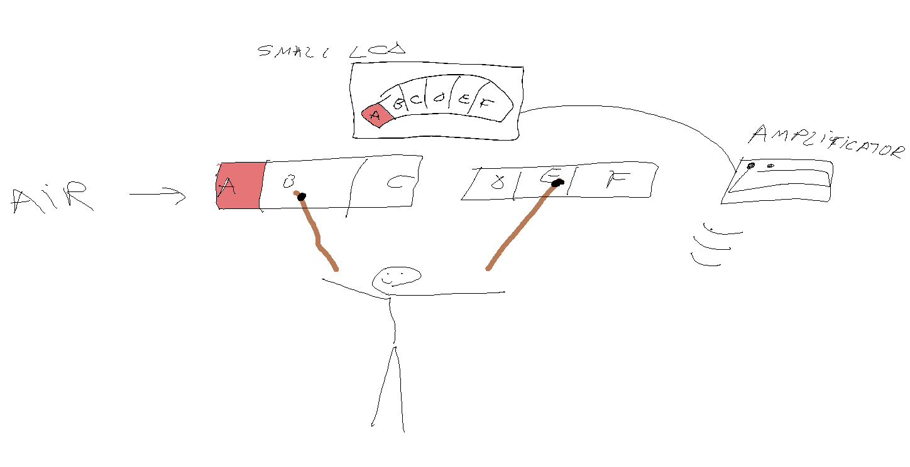
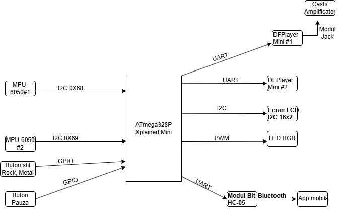
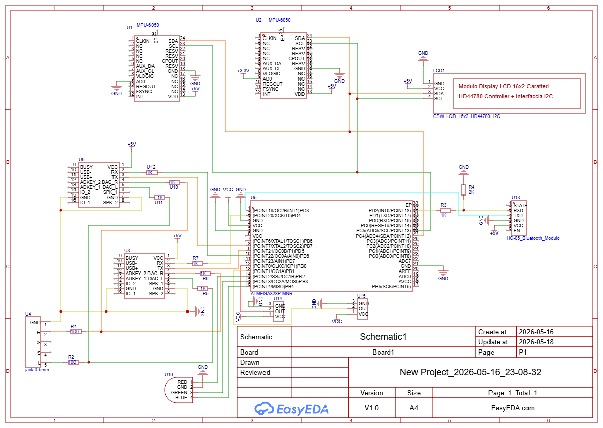
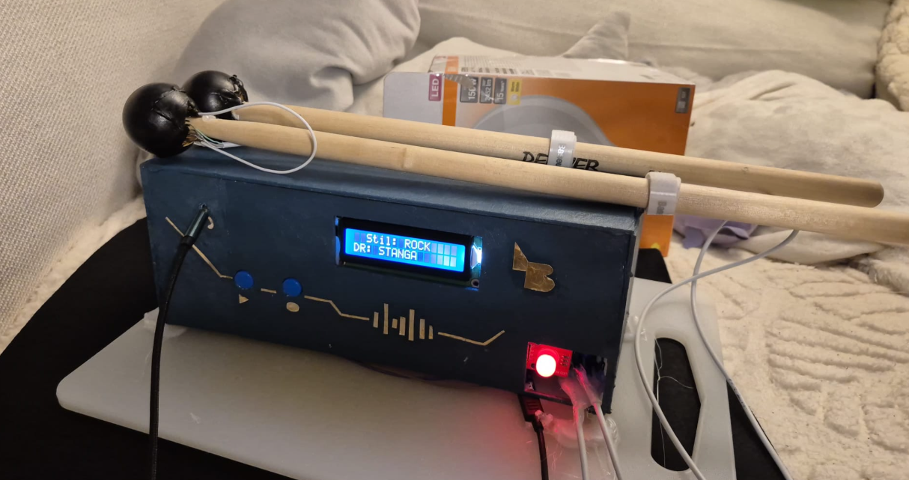

# Aero Beat — Tobe Aeriene

**Aero Beat** este un instrument muzical virtual care simulează o baterie reală folosind două bețe de tobă echipate cu senzori de mișcare. Fiecare bată conține un modul MPU-6050 montat pe vârf, care detectează direcția loviturii în aer. Sistemul identifică una dintre cele 3 tobe virtuale per bâtă (stânga, mijloc, dreapta) și redă în timp real sunetul corespunzător printr-un amplificator de chitară sau căști. Simultan, un LED RGB se aprinde, ecranul LCD afișează toba lovită, iar o aplicație mobilă Android evidențiază vizual toba sau un visualiser audio.


## The first IDEA:



## Descriere generală

Cântărețul ține câte o bată în fiecare mână și efectuează lovituri în aer. Sistemul detectează lovitura, identifică toba vizată pe baza direcției de mișcare, redă sunetul corespunzător, aprinde LED-ul RGB și trimite informația prin Bluetooth către aplicația mobilă.

Funcționalități principale:
- Detectare direcțională a loviturilor (stânga / mijloc / dreapta) pe fiecare bâtă
- Redare audio polifonică simultană prin două DFPlayer Mini independente
- Trei stiluri muzicale: ROCK, METAL, BILLIE JEAN — schimbabile în timp real
- Buton de pauză cu melodie de fundal pe loop
- LED RGB cu fade smooth per direcție (roșu / galben / mov)
- Aplicație Android cu drum kit interactiv și visualiser audio cu swipe



## Hardware Design

### Listă de piese

- ATmega328P Xplained Mini — microcontroler principal
- 2× GY-521 (MPU-6050) — senzori giroscop + accelerometru, montați pe vârful bețelor
- 2× DFPlayer Mini + card microSD — module redare audio MP3
- Modul Bluetooth HC-05
- Display LCD 16×2 cu interfață I2C (HD44780)
- LED RGB (anod comun)
- 2× Modul buton fără reținere
- Modul jack TRRS 3.5mm + adaptor 3.5mm → 6.35mm
- Amplificator de chitară (output audio)
- 2× bețe de tobă (suport fizic pentru senzori)
- Rezistoare (1kΩ, 2kΩ, 100Ω), fire, breadboard, 2× carduri microSD

### Schema electrică



### Conexiuni ATmega328P

| Pin ATmega | Conectare |
|---|---|
| PC4 / SDA | Bus I2C — MPU-6050 #1, #2 și LCD |
| PC5 / SCL | Bus I2C — MPU-6050 #1, #2 și LCD |
| PD2 | RXD HC-05 Bluetooth (prin divizor 1kΩ + 2kΩ) |
| PD3 | TXD HC-05 Bluetooth (direct) |
| PD4 | RX DFPlayer #1 (prin 1kΩ) |
| PD5 | TX DFPlayer #1 (direct) |
| PD6 | RX DFPlayer #2 (prin 1kΩ) |
| PD7 | TX DFPlayer #2 (direct) |
| PB0 (pin 8) | Buton 1 — pauză/resume |
| PB1 (pin 9) | Buton 2 — schimbare stil |
| PB2 (pin 10) | LED RGB roșu (PWM) |
| PB3 (pin 11) | LED RGB verde (PWM) |
| PB4 (pin 12) | LED RGB albastru |
| PB5 (pin 13) | LED on-board |

### Mixare audio

Ieșirile DAC ale ambelor DFPlayer-e sunt mixate pasiv prin rezistoare de izolare (1kΩ per canal per DFPlayer) și dirijate spre jack-ul TRRS prin rezistoare de protecție (100Ω). GND-ul jack-ului este conectat direct la GND-ul DFPlayer-elor, izolând masa audio de masa microcontrolerului pentru evitarea ground loop-ului.

### Arhitectura hardware


Detectarea loviturilor se realizează cu două MPU-6050 montate pe vârful bețelor, conectate pe același bus I2C (SDA/PC4, SCL/PC5). Diferențierea se face prin pinul AD0: senzorul bâtei stângi are AD0 la GND (adresă 0x68), cel al bâtei drepte la 3.3V (adresă 0x69). Pe același bus este conectat și LCD-ul (adresă 0x27).

Redarea sunetelor e asigurată de două DFPlayer Mini, câte unul per bâtă, comunicând prin SoftwareSerial: DF1 pe PD4/PD5, DF2 pe PD6/PD7. Rezistoare de 1kΩ protejează intrările RX (3.3V) față de logica de 5V a ATmega-ului.

Comunicația Bluetooth cu aplicația mobilă se face prin HC-05 pe PD2/PD3, cu divizor de tensiune 1kΩ+2kΩ pe linia RXD.

## Software Design

### Mediu de dezvoltare

- PlatformIO (VS Code) cu framework Arduino
- Board: ATmega328P Xplained Mini, upload via xplainedmini programmer
- Monitor serial la 57600 baud

### Librării

- `Wire.h` — comunicație I2C cu MPU-6050 #1, #2 și LCD
- `SoftwareSerial.h` — emulare UART pentru DFPlayer #1, #2 și HC-05
- `DFRobotDFPlayerMini` — control module MP3
- `LiquidCrystal_I2C` — control LCD 16×2

### Algoritm de detecție

Detectarea loviturilor se bazează pe o mașină de stări cu trei stări per bâtă: **READY → DETECTING → COOLING**.

La fiecare iterație de 5ms, microcontrolerul citește accelerația de la MPU-6050 și calculează magnitudinea (|dx| + |dy| + |dz|). Dacă depășește pragul HIT_THRESHOLD (6000 LSB, ~1.5g în mod ±8g), starea trece în DETECTING. Într-o fereastră de 30ms se urmăresc peak-urile pozitiv și negativ pe axa Y. La final se determină direcția: peak pozitiv dominant → DREAPTA, peak negativ dominant → STANGA, fără dominanță → MIJLOC. Starea COOLING previne detectarea multiplă, cu timeout de 250ms sau 2 samples calme.

### Funcții implementate

| Funcție | Rol |
|---|---|
| `mpu_init(addr)` | Inițializare MPU-6050: dezactivare sleep, ±8g, DLPF 44Hz |
| `calibrate(bat)` | Medierea a 200 de citiri pentru offset-uri de repaus |
| `mpu_read(addr, ax, ay, az)` | Citire 6 bytes accelerometru prin I2C |
| `process(bat)` | Mașina de stări de detecție per bâtă |
| `classify(bat)` | Determinare direcție, redare sunet, LCD, BT, LED |
| `setLedColor() / updateLed()` | Fade non-blocant LED RGB cu interpolare liniară |
| `setup()` | Inițializare completă: pini, I2C, LCD, DFPlayer-e, BT, MPU-uri, calibrare |
| `loop()` | Butoane, procesare senzori, actualizare LED |

## Laboratoare acoperite

- **Lab 0 — GPIO:** LED on-board, butoane, LED_B digital
- **Lab 1 — UART:** 3× SoftwareSerial (DF1, DF2, HC-05) la 9600 baud
- **Lab 3 — Timere/PWM:** `analogWrite()` pe LED_R (Timer1) și LED_G (Timer2)
- **Lab 6 — I2C:** 3 dispozitive pe același bus la 400kHz (MPU×2 + LCD)

## Aplicație Android

Aplicația Kotlin se conectează la HC-05 prin Bluetooth SPP, primește mesajele de tip `STG,STANGA\n` și evidențiază toba corespunzătoare pe o imagine reală de drum kit. Swipe stânga deschide un visualiser audio cu bare rainbow animate care reacționează la fiecare lovitură.

## Rezultate obținute



Proiectul funcționează. Lovești în aer cu două bețe și se aude ca și cum ai fi un toboșar — doar că nu ești, și nici nu ai fi fără acest sistem.

- Ambele bâte detectează corect direcția loviturii în timp real
- Sunetele celor două bâte se redau simultan fără interferențe
- Schimbarea stilului între ROCK, METAL și BILLIE JEAN funcționează instantaneu
- LED-ul RGB confirmă vizual fiecare lovitură cu fade smooth
- Aplicația Android afișează toba lovită și vizualizatorul reacționează la impact
- Butonul de pauză pornește o melodie pe loop — util când vrei să te prefaci că știi la chitară

## Probleme rezolvate

- **Overflow ±4g:** lovituri puternice depășeau range-ul → trecut la ±8g, praguri înjumătățite
- **Ground loop audio:** alimentarea din laptop la priză + amplificator la aceeași priză → zgomot bip-bip → fix: alimentare din power bank
- **Beep BT:** HC-05 în modul pairing consumă mult → ripple pe 5V → beep în căști → fix: perechiază înainte de pornire
- **SoftwareSerial simultan:** `listen()` blochează celelalte instanțe → eliminat, TX funcționează independent
- **Buton flotant:** `pinMode` lipsă cauza citiri false → adăugat `pinMode(BTN_PIN, INPUT)`

## Structura fișierelor

```
├── README.md
├── schema_bloc.png
├── schema_electrica.png
├── senzor.jpeg
├── src/
│   └── detector_tobe.cpp
└── android/ (not yet uploaded, but very much working)
    ├── MainActivity.kt
    ├── EqualizerView.kt
    └── res/
        ├── layout/activity_main.xml
        └── drawable/drum_kit.png
```

## Bibliografie

### Resurse Hardware
- MPU-6050 Product Specification — InvenSense
- MPU-6050 Register Map — InvenSense (RM-MPU-6000A)
- ATmega328P Xplained Mini User Guide — Microchip (DS50002659B)
- ATmega328P Datasheet — Microchip
- DFPlayer Mini Datasheet — DFRobot
- HC-05 Bluetooth Module AT Command Set

### Resurse Software
- [Arduino Wire Library](https://www.arduino.cc/en/reference/wire)
- [Arduino SoftwareSerial](https://www.arduino.cc/en/Reference/SoftwareSerial)
- [PlatformIO](https://docs.platformio.org)
- [DFRobotDFPlayerMini](https://github.com/DFRobot/DFRobotDFPlayerMini)
- [LiquidCrystal_I2C](https://github.com/johnrickman/LiquidCrystal_I2C)
- [Android Bluetooth SPP](https://developer.android.com/guide/topics/connectivity/bluetooth)